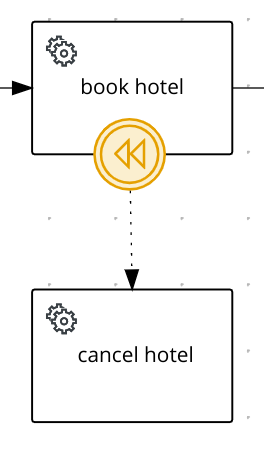
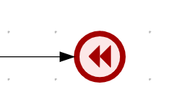

# Saga Process example with Quarkus

## Original work done by Tiago Dolphine

This is a standalone version of this https://github.com/tiagodolphine/kogito-examples/tree/process-saga-example

## Description

Service to demonstrate how to implement Saga pattern based on BPMN process with Kogito. The proposed example is based
 on an Order Fulfillment process which consists in a sequence of steps, that could represent calls to external
  services, microservices, serverless functions, etc.
  
 All steps `stock`, `payment` and `shipping` should be executed to confirm an Order, if any of the
  steps fail, then a compensation for each completed step should be executed to undo the operation or to keep the
   process on a consistent state. For instance, reserve stock step, should cancel the stock reservation. The
    compensations for the steps are represented in the process using a boundary `Intermediate Catching Compensation
Event` attached to the respective step to be compensated.          



The catching compensation events can be triggered by an `Intermediate Throwing Compensation Event` or the
 ` Compensation End Event` in any point of the process that represents an error or inconsistent state, like a response
  from a service.
 
 

The steps and compensations actions in the process example are implemented as service tasks using a Java class under
 the `src` of the project, and for this example they are just mocking responses, but in a real use case they
  could be executing calls to external services through REST, or any other mechanism depending on the architecture. 
 
 The start point of Saga process is to submit a request to create a new Order with a given `orderId`, this could be
  any other payload that represents an `Order`, but for the sake of simplicity, in this example it will be
   based on the `id` that could be used as a correlation to client starting the Saga.
  The output of each step, is represented by a `Response` that contains a type, indicating <b>success</b> or <b>error
  </b> and the id of the resource that was invoked in the service, but this could be any kind of response depending on
   the requirement of each service.

## Order Saga process

This is the BPMN process that represents the Order Saga, and it is the one being used in the project to be built using
 kogito.


## Installing and Running

### Prerequisites

You will need:
  - Java 11+ installed
  - Environment variable JAVA_HOME set accordingly
  - Maven 3.6.2+ installed

When using native image compilation, you will also need:
  - [GraalVM 19.1.1](https://github.com/oracle/graal/releases/tag/vm-19.1.1) installed
  - Environment variable GRAALVM_HOME set accordingly
  - Note that GraalVM native image compilation typically requires other packages (glibc-devel, zlib-devel and gcc) to be installed too.  You also need 'native-image' installed in GraalVM (using 'gu install native-image'). Please refer to [GraalVM installation documentation](https://www.graalvm.org/docs/reference-manual/aot-compilation/#prerequisites) for more details.

### Compile and Run in Local Dev Mode

```
mvn clean compile quarkus:dev
```

### Package and Run in JVM mode

```
mvn clean package
java -jar target/quarkus-app/quarkus-run.jar 
```

### Package and Run using Local Native Image

!!! NOT TESTED !!!
Note that this requires GRAALVM_HOME to point to a valid GraalVM installation

```
mvn clean package -Pnative
```

To run the generated native executable, generated in `target/`, execute

```
./target/process-saga-quarkus-runner
```

Note: Native builds does not yet work on Windows, GraalVM and Quarkus should be rolling out support for Windows soon.

## OpenAPI (Swagger) documentation
[Specification at swagger.io](https://swagger.io/docs/specification/about/)

You can take a look at the [OpenAPI definition](http://localhost:8080/openapi?format=json) - automatically generated and included in this service - to determine all available operations exposed by this service. For easy readability you can visualize the OpenAPI definition file using a UI tool like for example available [Swagger UI](https://editor.swagger.io).

In addition, various clients to interact with this service can be easily generated using this OpenAPI definition.

When running in either Quarkus Development or Native mode, we also leverage the [Quarkus OpenAPI extension](https://quarkus.io/guides/openapi-swaggerui#use-swagger-ui-for-development) that exposes [Swagger UI](http://localhost:8080/swagger-ui/) that you can use to look at available REST endpoints and send test requests.

## Usage

Once the service is up and running, you can use the following examples to interact with the service. Note that rather than using the curl commands below, you can also use the [Swagger UI](http://localhost:8080/swagger-ui/) to send requests.

### Starting the Order Saga

#### POST /orders

Allows to start a new Order Saga with the given data:

Given data:

```json
{
    "orderId" : "03e6cf79-3301-434b-b5e1-d6899b5639aa"
    
}
```

Curl command (using the JSON object above):

```sh
curl -H "Content-Type: application/json" -X POST http://localhost:8080/orders -d '{"orderId" : "03e6cf79-3301-434b-b5e1-d6899b5639aa"}'
```
The response for the request is returned with attributes representing the response of each step, either
 success or failure. The `orderResponse` attribute indicates if the order can be confirmed in case of success or
  canceled in case of error.

Response example:

```json
    {
        "id": "902a2caa-4ed0-4675-96e8-1434e1ea5bde",
        "paymentResponse": {
            "type": "SUCCESS",
            "resourceId": "af87e7b8-e455-4170-96e0-8bf23081158a"
        },
        "tripResponse": {
            "type": "SUCCESS",
            "resourceId": "03e6cf79-3301-434b-b5e1-d6899b5639aa"
        },
        "failService": null,
        "hotelResponse": {
            "type": "SUCCESS",
            "resourceId": "54101773-9a20-4e53-963c-353891ed8517"
        },
        "orderId": "03e6cf79-3301-434b-b5e1-d6899b5639aa",
        "flightResponse": {
            "type": "SUCCESS",
            "resourceId": "523d33be-815c-44f7-b52b-2337b770872d"
        }
    }
```

In the console executing the application you can check the log it with the executed steps.

```text
2020-11-05 16:23:32,478 INFO  [org.kie.kog.HotelService] (executor-thread-198) Book Hotel for t 3e6cf79-3301-434b-b5e1-d6899b5639aa
2020-11-05 16:23:32,481 INFO  [org.kie.kog.FlightService] (executor-thread-198) Book Flight for t 3e6cf79-3301-434b-b5e1-d6899b5639aa
2020-11-05 16:23:32,481 INFO  [org.kie.kog.PaymentService] (executor-thread-198) Create Payment for t 3e6cf79-3301-434b-b5e1-d6899b5639aa
Trip Success
```

#### Simulating errors to activate the compensation flows

To make testing the process easier it was introduced an optional attribute `failService` that indicates which service
 should respond with an error. The attribute is basically the simple  name of the service type, "Stock", "Payment" or "Shipping".

Example:

```json
{
    "orderId" : "03e6cf79-3301-434b-b5e1-d6899b5639aa",
    "failService" : "Payment"    
}
```
Curl command (using the JSON object above):

```sh
curl -H "Content-Type: application/json" -X POST http://localhost:8080/orders -d '{"orderId" : "03e6cf79-3301-434b-b5e1-d6899b5639aa", "failService" : "Payment"}' 
```

Response example:

```json
{
  "id": "501b67be-5e55-408b-ae69-2d34f71625c4",
  "stockResponse": {
    "type": "SUCCESS",
    "resourceId": "8adb55fb-b22e-4128-82e0-189e65a54e3a"
  },
  "paymentResponse": {
    "type": "ERROR",
    "resourceId": "e3389be1-be0f-4a92-a8d3-6066ac82a4d5"
  },
  "orderId": "03e6cf79-3301-434b-b5e1-d6899b5639aa",
  "failService": "Payment",
  "orderResponse": {
    "type": "ERROR",
    "resourceId": "03e6cf79-3301-434b-b5e1-d6899b5639aa"
  },
  "shippingResponse": null
}

```

In the console executing the application you can check the log it with the executed steps.

```text
10:52:49:487 INFO  [org.kie.kogito.StockService_Subclass] Created Stock for 03e6cf79-3301-434b-b5e1-d6899b5639aa with Id: 8adb55fb-b22e-4128-82e0-189e65a54e3a
10:52:49:488 INFO  [org.kie.kogito.PaymentService_Subclass] Created Payment for 03e6cf79-3301-434b-b5e1-d6899b5639aa with Id: e3389be1-be0f-4a92-a8d3-6066ac82a4d5
10:52:49:489 WARN  [org.kie.kogito.PaymentService_Subclass] Cancel Payment for e3389be1-be0f-4a92-a8d3-6066ac82a4d5
10:52:49:489 WARN  [org.kie.kogito.StockService_Subclass] Cancel Stock for 8adb55fb-b22e-4128-82e0-189e65a54e3a
10:52:49:490 WARN  [org.kie.kogito.OrderService] Failed Order 03e6cf79-3301-434b-b5e1-d6899b5639aa

```


## Deploying with Kogito Operator

In the [`operator`](operator) directory you'll find the custom resources needed to deploy this example on OpenShift with the [Kogito Operator](https://docs.jboss.org/kogito/release/latest/html_single/#chap_kogito-deploying-on-openshift).
